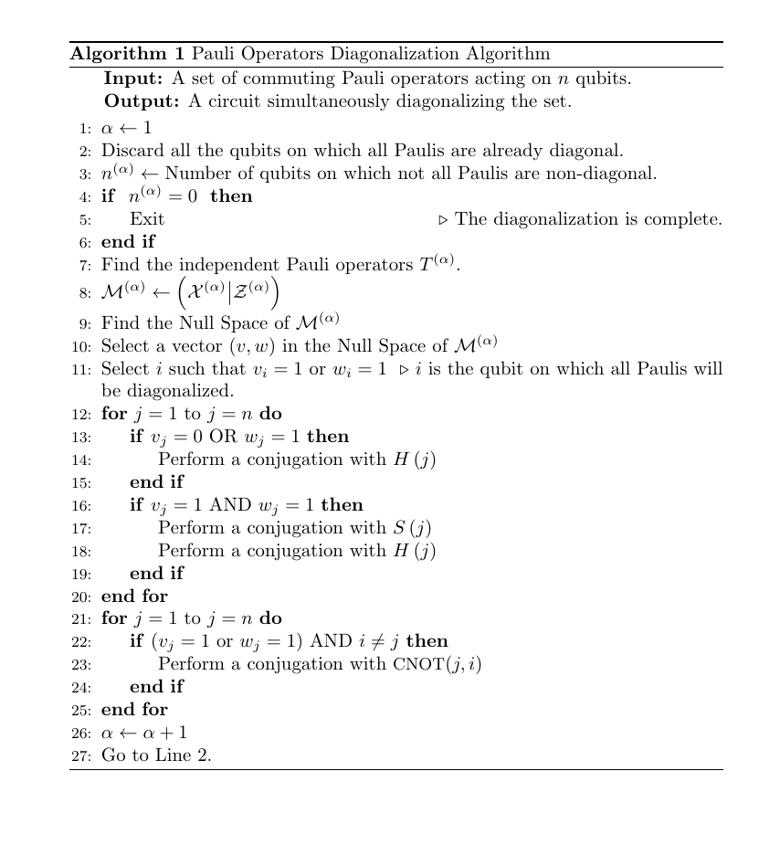

# Reducing Circuit Depth with Qubitwise Diagonalization

## Abstract
Simultaneous diagonalization of commuting Pauli operators is an important routine in several quantum algorithms. 
We present the implementation of an algorithm that yields a quantum circuit with depth only $\mathcal{O(n \log r)}$ diagonalizing n-qubit
operators generated by r independent Pauli operators. The algorithm is described in detail in [Paper](https://arxiv.org/abs/2306.00170).

## Pseudocdes

As explained in the paper, to achieve the lines XX to YY with the pseudocodes below

## Tutorial

### Prepare the commuting Pauli Strings
* Ensure the Pauli strings are writen in a file as shown below

* Call the function `helpers.read_hamiltonian(path_to_the_file)`
  - The function returns a list of Pauli strings objects (pstring class implemented in the file `pstring.py`)
  - We call this list `pauli_strings`
  - We will pass this list to the `main_diagonalizder` function in `diagonalize.py`

* Call the function `diagonalize.main_diagonalizer(pauli_strings)`
  - This function returns `X,Z,S,U`
  - `X`: The X part of the Tableau. It should always be `0` otherwise the diagonalization failed.
  - If `X` is not `0`, ensure that the Pauli strings given indeed commute with one another. If they do, contact the authors 
    - Edison Murairi: `emm712@gwu.edu`
    - Michael Cervia: `cervia@gwu.edu`
  - `Z`: The Z part of the Tableau. It contains the resulting Pauli strings from the diagonalization. See the paper for the description. 
  - `S`: The sign (`+` or `-`) of the resulting Pauli strings.
  - `U`: The resulting quantum circuit writen in `qiskit`.
