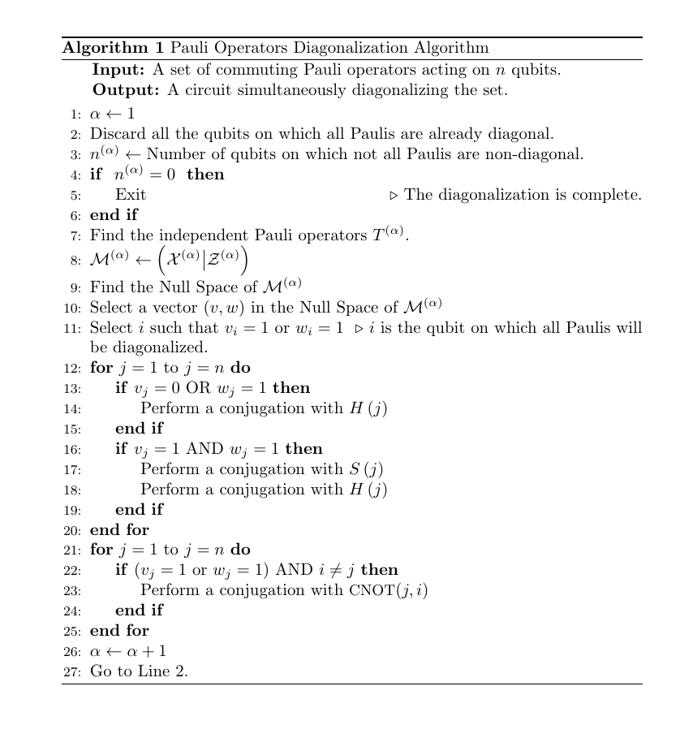

# Reducing Circuit Depth with Qubitwise Diagonalization

## Abstract
Simultaneous diagonalization of commuting Pauli operators is an important routine in several quantum algorithms. 
We present the implementation of an algorithm that yields a quantum circuit with depth only $\mathcal{O(n \log r)}$ diagonalizing n-qubit
operators generated by r independent Pauli operators. The algorithm is described in detail in [Paper](https://arxiv.org/abs/2306.00170).

## Pseudocdes

As explained in the paper, to achieve the lines XX to YY with the pseudocodes below

## Tutorial

### Prepare the commuting Pauli Strings
* Ensure the Pauli strings are writen in the file where each line is a Pauli string (for example XX (on the first line), YY (on the second line))
* Call the function `main` in the file diagonalize.py.
* The Function returns X, Z, S, U
* U is the quantum circuit
* X is the transformed X part of the tableau. It should be a zero matrix.
* Z is the transformed Z part of the tableau.
* S is the sign of the transformed Pauli strings. (0 means +, 1 means -)
